<h1 align="center"> Hello, I am Bento ☺️👋 </h1>

<h2 align="center"> 👀 A little about me 👀 </h2>

 Currently doing high school in IFMS, in the integrated course in internet computing, looking forward for being a web-developer.

<h1 align="center"> 🔌 My git stats 🔌 </h1>

<h1 align="center"> 💻 Main Languages 💻 </h1>

 

<h1 align="center"> ⌨️ What I use most ⌨️ </h1>

<h1 align="center"> ✨️ Working Now ✨️ </h1>

 I am a member of my campus robotics team, focusing in the programming part, and aiming for a big win in my country's national competition.
Learning C++ and C# for Arduino programming, and in-depth Python/Micropython. 

<h2 align="center"> 📸 My socials 📸 </h2>

